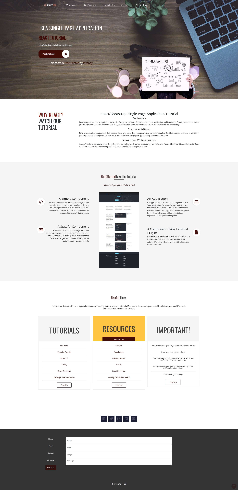

# Welcome to the React SPA Tutorial

The first one of our free react tutorial series. Before you begin, if you want to see the final app, please visit the link below:

[React SPA - Demo](https://react-singlepageapp.netlify.app/)

## Author
Vieira, Edson

### License

MIT 

## Pre-requisites:
* You need to have NPM 5.2+ installed

## Getting Started
* Clone the repo on your local machine: git clone https://edolivera@bitbucket.org/edolivera/spa.git
* Move to the folder: spa
* Install the application and its dependencies: npm install
* Then type: npm start
* And open [http://localhost:3000](http://localhost:3000) to view it in your browser.

## Or Watch our Youtube's tutorial

### Dependencies
npm install react-bootstrap bootstrap

The following line can be included in your src/index.js or App.js file:

import 'bootstrap/dist/css/bootstrap.min.css';

### Import Google Fonts
Copy and Paste in index.html (in public folder): 
<link href='https://fonts.googleapis.com/css?family=Oswald:400,300' rel='stylesheet' type='text/css'>
<link href='https://fonts.googleapis.com/css?family=Open+Sans:400,600' rel='stylesheet' type='text/css'>

### Install FontAwesome 
npm i --save @fortawesome/fontawesome-svg-core
### Free icons styles
npm i --save @fortawesome/free-solid-svg-icons
npm i --save @fortawesome/free-regular-svg-icons
npm i --save @fortawesome/react-fontawesome@latest

https://fontawesome.com/v6/docs/web/use-with/react/

### Free FontAwesome Brands
npm i @fortawesome/fontawesome-free-brands
https://www.npmjs.com/package/@fortawesome/fontawesome-free-brands

## React SPA- Full Page View

